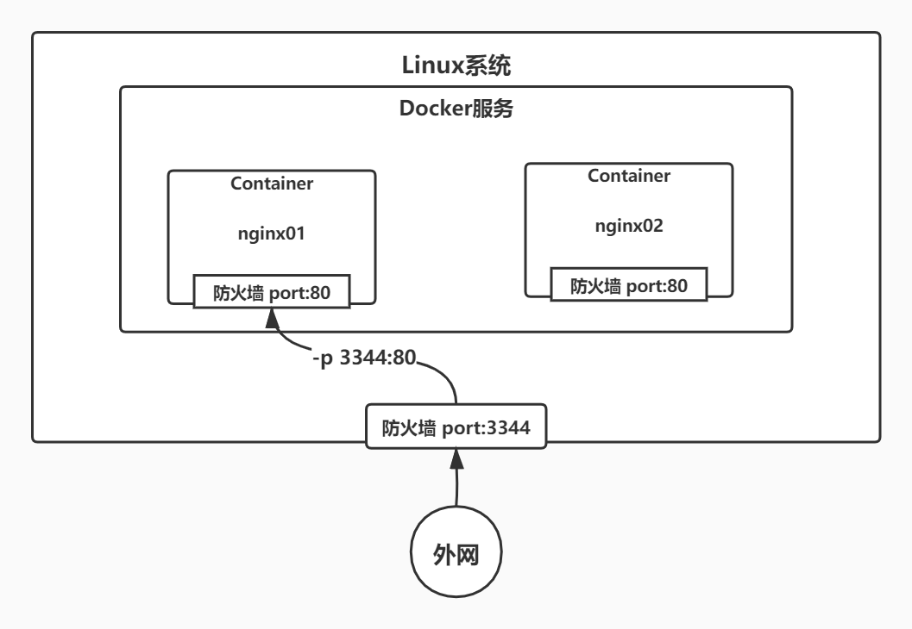

# Docker 常用命令


### 帮助命令

```bash
docker --help      # 帮助信息
docker info        # 系统信息
```

帮助文档地址：[https://docs.docker.com/engine/reference/](https://docs.docker.com/engine/reference/)

### 镜像命令

```bash
docker search 镜像名      # 搜索镜像
docker pull 镜像名        # 下载镜像
docker rmi 镜像名/id      # 删除镜像
```

Docker采用联合文件系统，不同镜像的相同文件无需再次下载：

### 容器命令

```bash
docker run [options] 镜像名/id [command]  # 建立容器并启动：           
[options]:                  
            --name=容器名                 # 命名容器以区分不同容器
            -d                           # 在后台运行容器（必须有一个前台进程，否则进程会自动关闭）
	    -it                          # 使用交互方式运行，进入容器查看内容
	    -p 主机端口:容器端口            # 暴露指定容器端口
	    -P                           # 暴露容器所有端口
[command]:
            /bin/bash                    # 控制台
```



```bash
Exit                         # 从容器中退回主机 
CTRL+Q+P                     # 容器不停止退出
docker ps                    # 显示当前运行的容器 
          -a                 # 带出历史运行过的容器
docker rm 容器名/id           # 删除指定容器
docker rm &(docker ps -aq)   # 删除全部容器
```

### 其他命令

```bash
docker start/restart/stop/kill 容器名/id               
docker logs -tf --tail 显示的日志条数 容器名/id  # 查看日志
docker top 容器名/id                 # 查看容器中的进程信息
docker inspect 容器名/id             # 查看镜像的元数据
docker exec -it 容器名/id /bin/bash  # 通常容器以后台方式运行，需要进入其中修改配置：进入容器后开启一个新终端         
docker attach 容器名/id              # 进入容器正在执行的终端
docker cp 容器名/id:容器内路径 主机文件路径       # 从容器内拷贝文件到主机上
```

