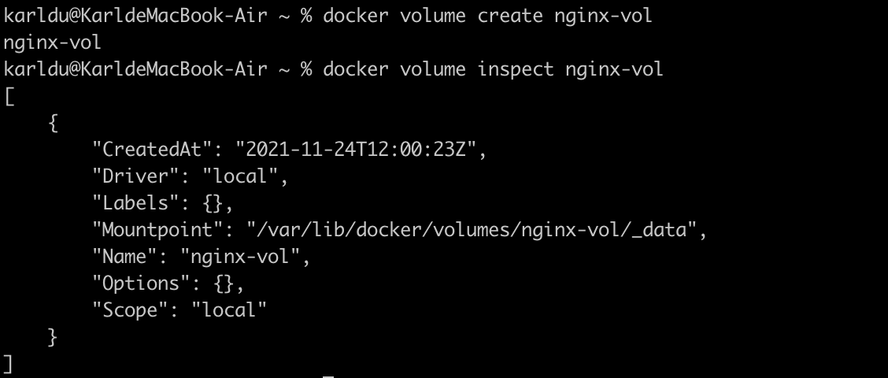
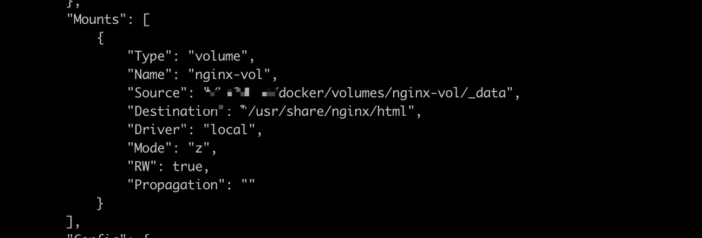

# Docker Volume

### 什么是 Volume

为了实现数据持久化，使容器之间可以共享数据。可以将容器内的目录，挂载到宿主机上或其他容器内，实现同步和共享的操作。即使将容器删除，挂载到本地的数据卷也不会丢失

### 管理数据卷

```bash
docker volume create nginx-vol   # 创建一个自定义容器卷
docker volume ls                 # 查看所有容器卷
docker volume inspect nginx-vol  # 查看指定容器卷详情信息
```

例如，创建一个自定义容器 `nginx-vol`：



### 具名挂载

使用命令：

```bash
# dokcer run -it -v 卷名:容器内目录 镜像名/id
docker run -d -it --name=my-nginx -p 8800:80 -v nginx-vol:/usr/share/nginx/html nginx
```

将容器内目录挂载到主机内目录上，通过`docker inspect`命令查看该容器即可以看到挂载信息:




注意：如果挂载的是指定目录，那么容器内目录将会和主机目录保持一致（如果主机目录为空，那么容器目录也会清空）


建立挂载关系后，容器和主机的文件将同步和共享

### 匿名挂载（不推荐）

```shell
docker run -d  -v 容器内目录  镜像名/id  # 匿名挂载
```

匿名挂载后，使用 **docker volume ls** 命令查看所有挂载的卷：


每一个VOLUME NAME对应一个挂载的卷，由于挂载时未指定主机目录，因此无法直接找到目录。

### 清理卷

如果不再使用自定义卷了，你可以清理卷

```bash
docker stop my-nginx # 暂停容器实例
docker rm my-nginx # 移除容器实例
docker volume rm nginx-vol # 删除自定义数据卷
```

