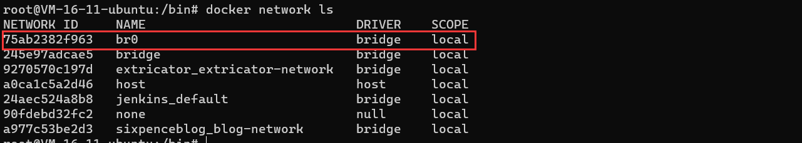

# Docker 网络原理

当我们准备把 Docker 技术应用到生产环境里必须要了解很多网络方面的知识。容器与主机、容器与容器之间是相互隔离的。但是我们可以通过配置 Docker 网络，为容器创建完全独立的网络命名空间，或者使容器共享主机或者其他容器的网络命名空间，以应对不同场景的需求。

Docker 有四种常用的单宿主机网络模式：

1. bridge（默认网络模式，通过主机和容器的端口映射（iptable转发）来通信。桥接是在主机上，一般叫docker0）
2. host（与主机共享网络）
3. container（将容器的网络栈合并到一起，可与其他容器共享IP地址和端口范围等）
4. none（不为容器进行任何网络配置，容器不能访问外部网络，内部存在回路地址）

我们可以通过`docker network ls`查看 Docker 原生的几种网络模式：

.png>)

### 1、bridge 模式

Docker 服务器启动时，会自动在宿主机上创建一个 docker0 虚拟网桥（Linux Bridge，可以理解为一个软件虚拟出来的交换机）。它会在挂载到它的网口之间进行转发。同时 Docker 随机分配一个可用的私有 IP 地址给 docker0 接口。如果容器使用默认网络参数启动，那么它的网口也会自动分配一个与 docker0 同网段的 IP 地址。

我们使用命令`ip address show dev docker0`获取 docker0 网络信息，它的地址是 172.17.0.1，子网掩码为 255.255.0.0 如下图所示：

.png>)

我们创建两个容器：server、client

```shell
docker run -d -t --name client carldu/extricator-ui:latest
docker run -d -t --name server carldu/extricator-server:latest
```

容器新建成功后，查看两个容器的 IP 地址:

```shell
docker inspect client
docker inspect server
```

两个容器互相 ping，证明两个网络能通：

```shell
docker exec -it client ping 172.17.0.3
docker exec -it client ping 172.17.0.2
```

#### 1.1 自定义网桥

除了可以使用默认 docker0 做网桥，我们还可以使用`docker network`相关命令自定义网桥：

```shell
docker network create -d bridge --subnet '172.71.0.0/24' --gateway '172.71.0.1' br0
# -d -- driver 指定管理网络的驱动方式，默认为bridge
# --subnet 指定子网网段
# --gateway 指定默认网关
```

我们使用docker network ls查看当前的 docker 网络列表，发现新增的 br0 网桥



接下来，我们尝试在使用这个网桥 br0 来新建运行两个容器，并测试它们的连通性。分别运行 b2，b3 两个容器：

```shell
docker run -d -t --name client carldu/extricator-ui:latest
docker run -d -t --name server carldu/extricator-server:latest
```

容器新建并运行成功后，分别执行下列命令，互相 ping 一下验证网络连通：

```
docker exec -it client ping server
docker exec -it server ping client
```

ping 测试过程中，输入的并不是 IP，而是容器名。在自定义网桥中，容器名会在需要的时候自动解析到对应的 IP，也解决了容器重启可能导致 IP 变动的问题。

#### 释放

不再使用的容器删除后，记得释放空间和资源

```shell
docker rm -f client server
docker network rm br0
```

### 2、host 模式

Docker 使用了 Linux 的命名空间来进行资源隔离。在默认 bridge 模式下，一个 Docker 容器一般会分配一个独立的 Network 命名空间。 但如果在启动容器的时候使用 host 模式，那么这个容器将不会获得一个独立的 Network 命名空间，而是和宿主机共用一个 Network 命名空间。 容器将不会虚拟出自己的网卡、配置自己的 IP 地址等，而是使用宿主机的 IP 与端口。

```shell
docker run -it --network=host busybox
```

#### 小结

host 模式下的容器与宿主机共享同一个网络环境，容器可以使用宿主机的网卡和外界的通信，不需要转发拆包，性能好。但 host 模式也有非常严重的缺点：**容器没有隔离的网络，会与其他服务竞争宿主机的网络，导致宿主机网络状态不可控，因此无法用在生产环境**。

### 3、container 模式

与 host 模式类似，container 模式可以使一个容器共享另一个已存在容器的网络，此时这两个容器共同使用同一网卡、主机名、IP 地址，容器间通讯可直接通过本地回环 lo 接口通讯。

#### 小结

在 container 模式下的容器，会使用其他容器的网络命名空间，其网络隔离性会处于 bridge 桥接模式与 host 模式之间：当容器共享其他容器的网络命名空间，则在容器之间不存在网络隔离；而它们又与宿主机以及其他不在此共享中的容器存在网络隔离。

### 4、none 模式

容器有自己的网络命名空间，但不做任何配置，它与宿主机、与其他容器都不连通的。我们新建一个 none 模式的 busybox 镜像 b0：
