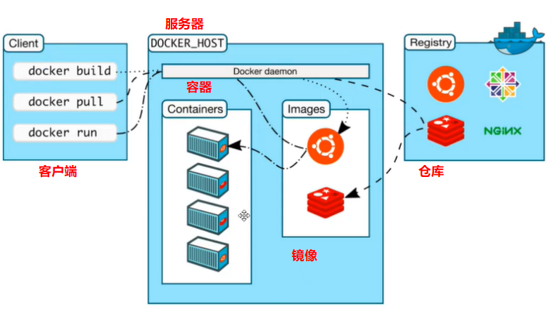

# Docker 基本组成



### Image 镜像

#### 概念

镜像是什么？如果你理解什么是虚拟机，那么你很快就能理解什么是镜像。如果你想在自己的电脑上安装一个 Win7 虚拟机，那么你肯定需要一个 ISO 镜像文件，这个文件由微软去打包提供给我们下载使用。你可以这样去理解：镜像就是一个程序的副本。

#### 与虚拟机的区别

那么虚拟机镜像和 Docker 镜像有什么区别？

| 虚拟机                    | Docker                    |
| ---------------------- | ------------------------- |
| linux centos原生镜像（一个电脑） | 隔离镜像（最核心的环境 +jdk +mysql等) |
| 需要开启多个虚拟机              | 运行镜像就可以了                  |
| 几GB                    | 几MB                       |

### Repository 仓库

镜像仓库是一个存储库，用于存储基于容器应用开发的容器镜像。镜像仓库有两种类型：公开和私有。

公共镜像仓库适用于希望尽快启动并运行镜像仓库的个人或小团队。它们有基本的功能/服务，使用简单。

小型的初创企业可利用标准和开源镜像从头开始，逐渐发展。然而，在发展过程中，可能会出现补丁、隐私和访问控制等安全问题。&#x20;

通过私有镜像仓库，您可将安全与隐私整合到远程托管或内部托管的企业容器镜像存储中。公司可选择创建并部署自己的容器镜像仓库，也可选择商业支持的私有镜像仓库服务。这些私有镜像仓库通常具有高级安全功能和技术支持，[红帽® Quay](https://www.redhat.com/zh/technologies/cloud-computing/quay) 就是一个很好的例子。

私有镜像仓库的优势就是能控制访问

### Container 容器

容器是通过镜像去创建的实例，就好比面向对象编程里的类，镜像就是类，而容器就是实例。你可以通过命令去运行容器、删除容器或者停止容器。而容器与容器之间是相互独立的，这也是 Docker 的核心思想之一：隔离。

### 流程

#### 生成镜像

在做部署工作之前，我们需要去发布我们程序的镜像：

```bash
$ docker build -t myProgram:v1.0 .
```

这里 -t 等于 --tag，我们习惯用简写命令，去给镜像打一个标签。myProgram:v1.0 就是我们一个标签名。. 代表当前目录下的Dockerfile文件，或者你可以用 -f 来表示

#### 发布镜像

镜像生成后，我们需要把镜像发布到镜像仓库：

```bash
$ docker push myProgram:v1.0
```

#### 拉取镜像

镜像发布到远程镜像仓库后，我们在生产环境去拉取镜像：

```bash
$ docker pull myProgram:v1.0
```

#### 创建容器

镜像拉取成功后，我们可以直接创建容器来运行程序了：

```bash
$ docker run --name myProgram -d myProgram:v1.0 -p 80:80
```

\--name 是指定容器名，-d 是指定镜像名，-p 是映射程序对应端口到本机

###
