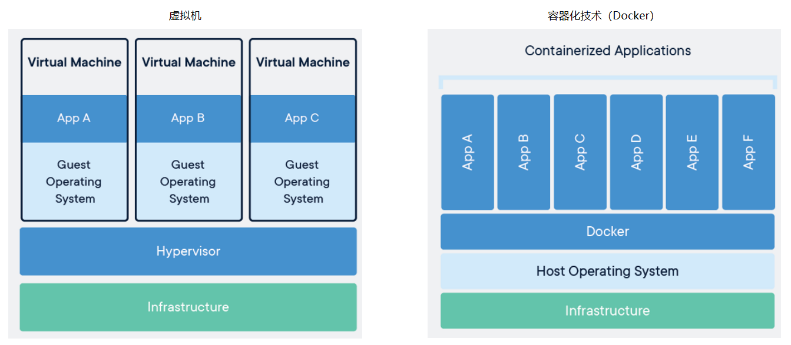

# Docker 介绍

### 为什么会出现？

产品的部署往往是十分麻烦的，在很多公司是由实施或运维专人负责。部署的过程中会对着部署文档一步一步小心谨慎的点击下一步。而开发人员，则要搭建一套开发环境，这套开发环境当然和生产环境有部分差异，它们端口不同、配置不同、文件存储策略不同等等。

我想以下问题是大部分人都会遇到的：

* 一款产品：开发、线上两套环境
* 一堆文档和安装程序，环境配置费时费力
* 开发需要懂运维，运维需要懂开发
* 一个产品需要开发和运维
* 一个环境存在多个应用，相互影响

### 诞生

2010 年，几个搞 IT 的年轻人，就在美国成立了一家公司 dotCloud。做一些 PaaS （Platform-as-a-Service, PaaS）的云计算服务，LXC 有关的容器技术。他们将自己的技术（容器化技术）命名就是 Docker。

Docker 刚刚诞生的时候，没有引起行业的注意，dotCloud 就没办法活下去。2013 年，他们选择将 Docker 开源。于是，越来越多的人发现了 Docker，慢慢的，Docker 走进了人们的视野。

2014年4月9号，Docker 1.0 发布。

### Docker 的优点

如果你熟悉微软 C# 的 nuget，或者是 npm 的包管理，那么你能在 Docker 这个镜像发布流程找到一个相似的感觉。通过上面一个阶段的介绍，我们不难发现 Docker 有以下几个优点：

* **更高效的利用了系统资源**。由于容器不需要进行硬件虚拟化以及运行完整操作系统等额外开销，Docker 对系统资源的利用率更高。无论是应用执行速度、内存损耗以及文件存储速度，都要比传统虚拟机技术更高效。
* **更好的安全性**。每个容器相互隔离，内部都有属于自己的文件系统，互不影响。
* **更快的启动时间**。传统的虚拟机技术启动应用服务往往需要数分钟， Docker 容器由于直接运行于宿主内核，无需启动完整的操作系统，因此可以超快启动容器应用。节约了开发、测试和部署的时间
* **一致的运行环境**。开发过程中有一个令人头疼的问题是环境一致性问题。由于开发环境、测试环境、生产环境不一致，导致有些 Bug 并未在开发过程中被发现。而 Docker 的镜像提供了除内核外完整的运行时环境，确保了应用运行环境一致性
* **持续交付和部署**。使用 Docker可以通过定制应用镜像来实现持续集成、持续交付、部署。开发者可以通过 Dockerfile 来进行镜像构建，并结合持续集成系统进行集成测试，运维则可以直接在生产环境中快速部署该镜像，结合持续部署系统进行自动部署
* **更轻松的迁移**。由于 Docker 确保了执行环境的一致性，使得应用的迁移更加容易。Docker可以在很多平台上运行，无论是物理机、虚拟机、公有云、私有云，其运行结果是一致的。用户可以很轻易地将应用迁移到另一个平台上，不用担心运行环境的变化
* **更轻松的维护和扩展**。Docker 使用的分层存储以及镜像的技术，使得应用重复部分的复用更为容易，也使得应用的维护更新更加简单，基于基础镜像进一步扩展镜像也变得非常简单。Docker团队同各个开源项目团队一起维护了一大批高质量的官方镜像，既可以直接在生产环境使用，又可以作为基础进一步定制，大大的降低了应用服务的镜像制作成本
*   **对比传统虚拟机**

    | 虚拟机                    | Docker                    |
    | ---------------------- | ------------------------- |
    | linux centos原生镜像（一个电脑） | 隔离镜像（最核心的环境 +jdk +mysql等) |
    | 需要开启多个虚拟机              | 运行镜像就可以了                  |
    | 几GB                    | 几MB                       |

### Docker VS 虚拟机

Docker 常常被人和虚拟机相提并论，但是它们区别很大

Docker 不模拟完整的操作系统，系统内核（kernel）非常小，更少的抽象层（GuestOS：如Centos）。容器内的应用直接运行在宿主机的内核，容器本身没有自己的内核，也没有虚拟硬件。每个容器 **相互隔离**，内部都有属于自己的文件系统，互不影响。

### Docker 实现 DevOps

* 应用更快速的交付和部署\
  打包镜像发布测试，一键运行；不再需要写大量帮助文档，安装程序
* 更便捷的升级和扩缩容？\
  部署应用就和搭积木一样
* 更简单的系统运维\
  开发和测试的环境高度一致
* 更高效的计算资源利用\
  内核级别的虚拟化，可以在一个物理机上运行很多的容器实例，服务器性能可以被压榨到极致。
