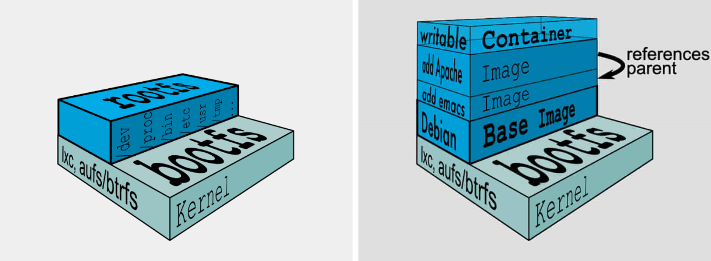

# UnionFS 与 Docker

### 什么是文件系统

计算机的文件系统是一种存储和组织计算机数据的方法，它使得对其访问和查找变得容易，文件系统使用文件和树形目录的抽象逻辑概念代替了硬盘和光盘等物理设备使用数据块的概念，用户使用文件系统来保存数据不必关心数据实际保存在硬盘（或者光盘）的地址为多少的数据块上，只需要记住这个文件的所属目录和文件名。在写入新数据之前，用户不必关心硬盘上的那个块地址没有被使用，硬盘上的存储空间管理（分配和释放）功能由文件系统自动完成，用户只需要记住数据被写入到了哪个文件中。

一句话总结，文件系统是一套实现了数据的存储、分级组织、访问和获取等操作的抽象数据类型。

### 什么是 UnionFS

> 联合文件系统（Union File System）：2004 年由纽约州立大学开发，它可以把多个目录内容联合挂载到同一个目录下，而目录的物理位置是分开的。UnionFS可以把只读和可读写文件系统合并在一起，具有写时复制功能，允许只读文件系统的修改可以保存到可写文件系统当中。

联合文件系统（UnionFS）是一种分层、轻量级并且高性能的文件系统，它支持对文件系统的修改作为一次提交来一层层的叠加，同时可以将不同目录挂载到同一个虚拟文件系统下。联合文件系统是 Docker 镜像的基础。镜像可以通过分层来进行继承，基于基础镜像（没有父镜像），可以制作各种具体的应用镜像。UnionFS 一次同时加载多个文件系统，但从外面看起来只能看到一个文件系统。联合加载会把各层文件系统叠加起来，这样最终的文件系统会包含所有底层的文件和目录。

### Docker 如何使用 UnionFS

Docker 的官方文档中有一张图片，很好地展示了 Docker 使用 UnionFS 搭建的分层结构的状态

图中的容器是运行在 debian 容器环境中的 apache 网页应用，这个环境还提供了 emacs 编辑器功能。

Docker 引入了层（layer）的概念，将 rootfs 的内容进行了 **分层管理**，有系统层，运行库依赖层等等，可以一层接一层进行增量式挂载叠加。启动容器的时候通过 UnionFS 把相关的层挂载到一个目录，作为容器的根 rootfs。

借助于 UnionFS，容器内部的更改都被保存到了最上面的读写层，而其他层都是只读的，这样中间的只读 rootfs 是可以被多个容器复用的。UnionFS 将文件的更新挂载到老的文件之上，而不去修改那些不更新的内容，这就意味着即使虚拟的文件系统被反复修改，也能保证宿主机空间占用保持一个较低水平。

### 镜像加载原理

Docker的镜像实际由一层一层的文件系统组成：

* bootfs（boot file system）主要包含bootloader和kernel。bootloader主要是引导加载kernel，完成后整个内核就都在内存中了。此时内存的使用权已由bootfs转交给内核，系统卸载bootfs。可以被不同的Linux发行版公用。
* rootfs（root file system），包含典型Linux系统中的/dev，/proc，/bin，/etc等标准目录和文件。rootfs就是各种不同操作系统发行版（Ubuntu，Centos等）。因为底层直接用Host的kernel，rootfs只包含最基本的命令，工具和程序就可以了。
* 分层理解\
  所有的Docker镜像都起始于一个基础镜像层，当进行修改或增加新的内容时，就会在当前镜像层之上，创建新的容器层。\
  容器在启动时会在镜像最外层上建立一层可读写的容器层（R/W），而镜像层是只读的（R/O）。

### 小结

在 rootfs 的基础上，Docker 公司创新性地提出了使用 UnionFS，多个增量 rootfs 联合挂载一个完整 rootfs 的方案，通过“**分层镜像**”的设计，围绕 Docker 镜像，大家甚至可以协同工作，再加上 Docker 官方提供的镜像仓库，进一步减少了共享镜像的成本，这大大提高了开发部署的效率。
